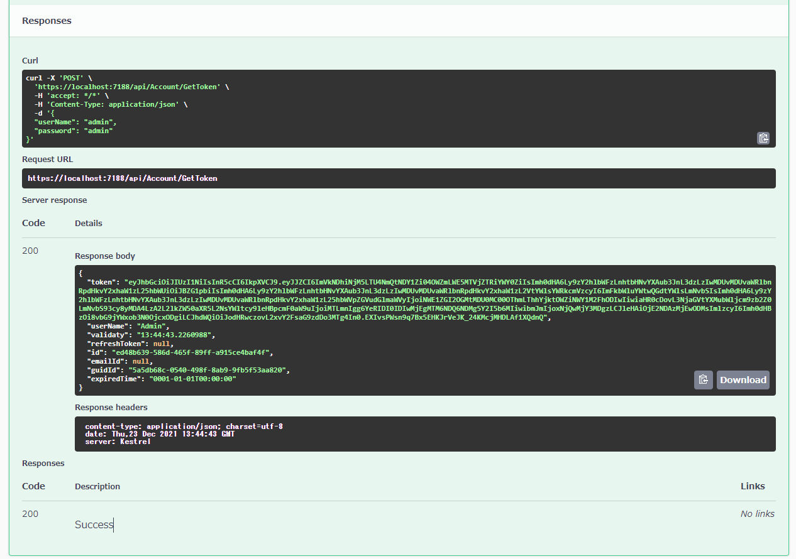
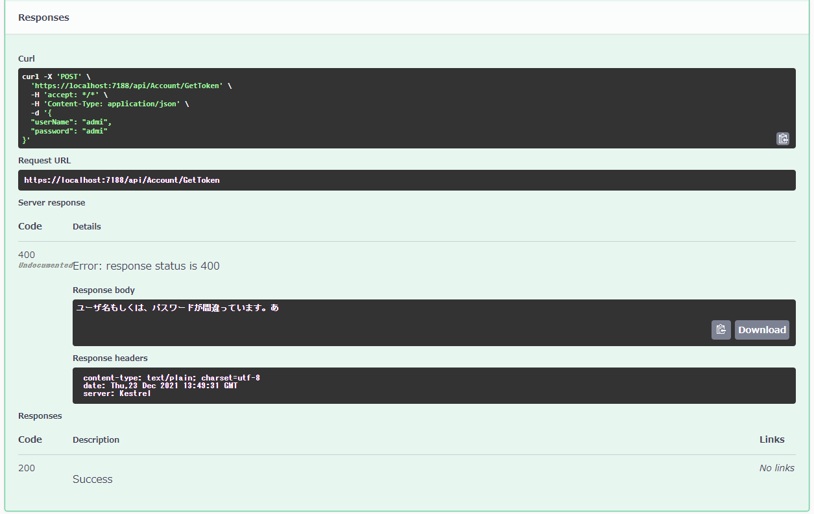

# 
[参考サイト](https://www.c-sharpcorner.com/article/jwt-token-authentication-and-authorizations-in-net-core-6-0-web-api/)

# 成功
```Text
HTTP Status 200	
Response body
Download
{
  "token": "eyJhbGciOiJIUzI1NiIsInR5cCI6IkpXVCJ9.eyJJZCI6ImVkNDhiNjM5LTU4NmQtNDY1Zi04OWZmLWE5MTVjZTRiYWY0ZiIsImh0dHA6Ly9zY2hlbWFzLnhtbHNvYXAub3JnL3dzLzIwMDUvMDUvaWRlbnRpdHkvY2xhaW1zL25hbWUiOiJBZG1pbiIsImh0dHA6Ly9zY2hlbWFzLnhtbHNvYXAub3JnL3dzLzIwMDUvMDUvaWRlbnRpdHkvY2xhaW1zL2VtYWlsYWRkcmVzcyI6ImFkbWluYWtwQGdtYWlsLmNvbSIsImh0dHA6Ly9zY2hlbWFzLnhtbHNvYXAub3JnL3dzLzIwMDUvMDUvaWRlbnRpdHkvY2xhaW1zL25hbWVpZGVudGlmaWVyIjoiNWE1ZGI2OGMtMDU0MC00OThmLThhYjktOWZiNWY1M2FhODIwIiwiaHR0cDovL3NjaGVtYXMubWljcm9zb2Z0LmNvbS93cy8yMDA4LzA2L2lkZW50aXR5L2NsYWltcy9leHBpcmF0aW9uIjoiMTLmnIgg6YeRIDI0IDIwMjEgMTM6NDQ6NDMg5Y2I5b6MIiwibmJmIjoxNjQwMjY3MDgzLCJleHAiOjE2NDAzMjEwODMsImlzcyI6Imh0dHBzOi8vbG9jYWxob3N0OjcxODgiLCJhdWQiOiJodHRwczovL2xvY2FsaG9zdDo3MTg4In0.EXIvsPWsn9q7Bx5EHKJrVeJK_24KMcjMHDLAf1XQdnQ",
  "userName": "Admin",
  "validaty": "13:44:43.2260988",
  "refreshToken": null,
  "id": "ed48b639-586d-465f-89ff-a915ce4baf4f",
  "emailId": null,
  "guidId": "5a5db68c-0540-498f-8ab9-9fb5f53aa820",
  "expiredTime": "0001-01-01T00:00:00"
}
```
<a> </a>




# エラー集
## 最初の実装エラー(Extentionsの実装ミス)
```
System.InvalidOperationException: Unable to resolve service for type 'WebAppdotNet6JWT.Models.JwtSettings' while attempting to activate 'WebAppdotNet6JWT.Controllers.AccountController'.
   at Microsoft.Extensions.DependencyInjection.ActivatorUtilities.GetService(IServiceProvider sp, Type type, Type requiredBy, Boolean isDefaultParameterRequired)
   at lambda_method3(Closure , IServiceProvider , Object[] )
   at Microsoft.AspNetCore.Mvc.Controllers.ControllerActivatorProvider.<>c__DisplayClass7_0.<CreateActivator>b__0(ControllerContext controllerContext)
   at Microsoft.AspNetCore.Mvc.Controllers.ControllerFactoryProvider.<>c__DisplayClass6_0.<CreateControllerFactory>g__CreateController|0(ControllerContext controllerContext)
   at Microsoft.AspNetCore.Mvc.Infrastructure.ControllerActionInvoker.Next(State& next, Scope& scope, Object& state, Boolean& isCompleted)
   at Microsoft.AspNetCore.Mvc.Infrastructure.ControllerActionInvoker.InvokeInnerFilterAsync()
--- End of stack trace from previous location ---
   at Microsoft.AspNetCore.Mvc.Infrastructure.ResourceInvoker.<InvokeFilterPipelineAsync>g__Awaited|20_0(ResourceInvoker invoker, Task lastTask, State next, Scope scope, Object state, Boolean isCompleted)
   at Microsoft.AspNetCore.Mvc.Infrastructure.ResourceInvoker.<InvokeAsync>g__Awaited|17_0(ResourceInvoker invoker, Task task, IDisposable scope)
   at Microsoft.AspNetCore.Mvc.Infrastructure.ResourceInvoker.<InvokeAsync>g__Awaited|17_0(ResourceInvoker invoker, Task task, IDisposable scope)
   at Microsoft.AspNetCore.Routing.EndpointMiddleware.<Invoke>g__AwaitRequestTask|6_0(Endpoint endpoint, Task requestTask, ILogger logger)
   at Microsoft.AspNetCore.Authorization.AuthorizationMiddleware.Invoke(HttpContext context)
   at Swashbuckle.AspNetCore.SwaggerUI.SwaggerUIMiddleware.Invoke(HttpContext httpContext)
   at Swashbuckle.AspNetCore.Swagger.SwaggerMiddleware.Invoke(HttpContext httpContext, ISwaggerProvider swaggerProvider)
   at Microsoft.AspNetCore.Diagnostics.DeveloperExceptionPageMiddleware.Invoke(HttpContext context)

HEADERS
=======
Accept: */*
Host: localhost:7188
User-Agent: Mozilla/5.0 (Windows NT 10.0; Win64; x64) AppleWebKit/537.36 (KHTML, like Gecko) Chrome/96.0.4664.110 Safari/537.36
:method: POST
Accept-Encoding: gzip, deflate, br
Accept-Language: ja,en-US;q=0.9,en;q=0.8,und;q=0.7
Content-Type: application/json
Cookie: PGADMIN_LANGUAGE=ja,ai_user=602+Q|2021-12-23T05:53:50.439Z,ai_session=V4Q15|1640264422296.5|1640264422296.5
Origin: https://localhost:7188
Referer: https://localhost:7188/swagger/index.html
Content-Length: 48
sec-ch-ua: " Not A;Brand";v="99", "Chromium";v="96", "Google Chrome";v="96"
sec-ch-ua-mobile: ?0
sec-ch-ua-platform: "Windows"
sec-fetch-site: same-origin
sec-fetch-mode: cors
sec-fetch-dest: empty
```
原因は、Extensionのスペルミス
```C#
   //間違い
   public static void AddJWTTokenServices(IServiceCollection Services, IConfiguration Configuration) {

```
```C#
   //正しい
  public static void AddJWTTokenServices(this IServiceCollection Services, IConfiguration Configuration)
```
